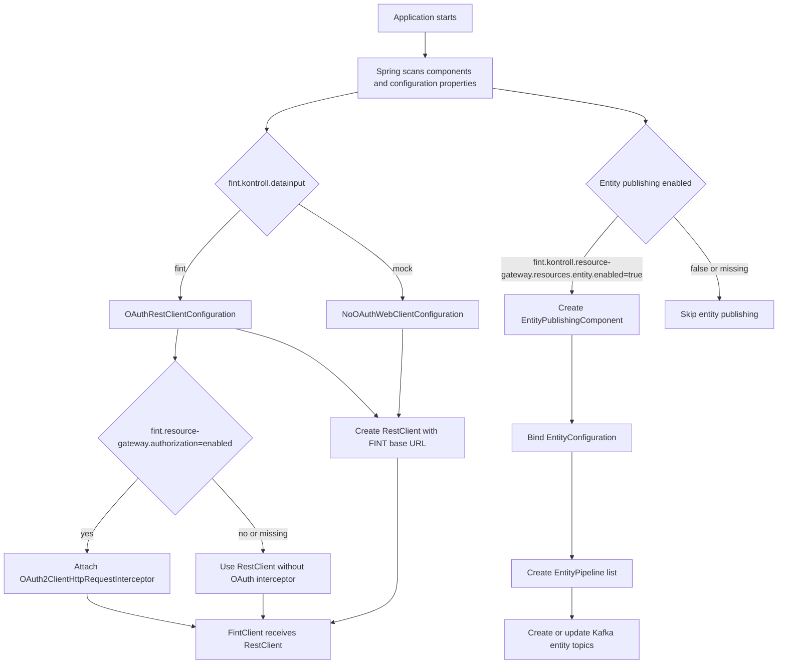
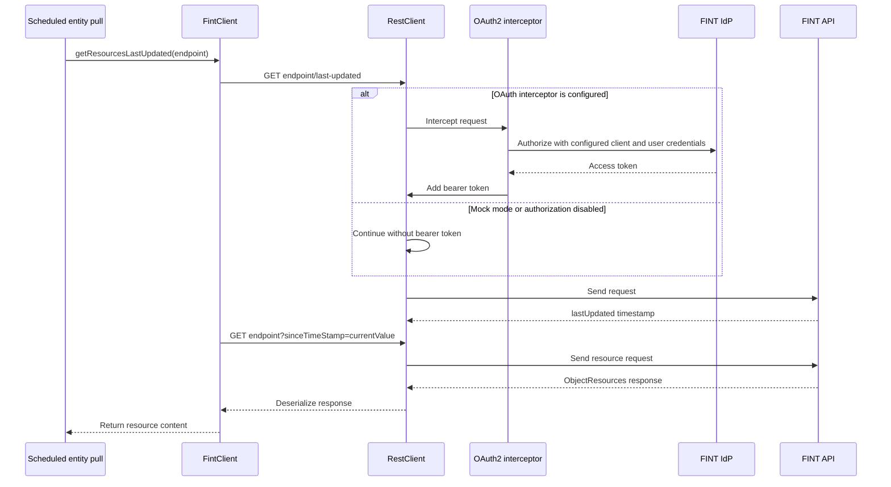
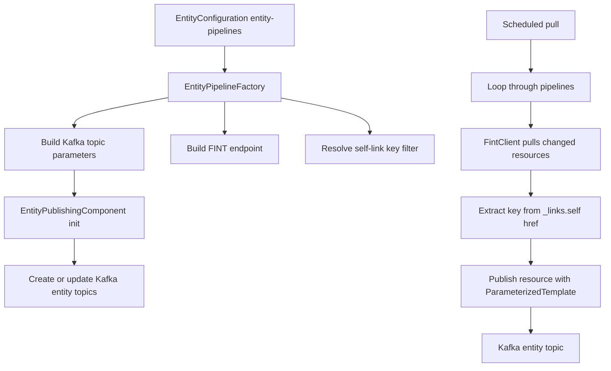

# FINT Kontroll FINT Gateway Documentation

## Purpose

`fint-kontroll-fint-gateway` pulls resources from FINT and publishes selected entity resources to Kafka topics used by Kontroll services.

The application is a Spring Boot service written in Kotlin. Its main runtime responsibilities are:

1. Configure a `RestClient` for either real FINT access or local mock access.
2. Pull changed FINT resources using the FINT `last-updated` pattern.
3. Convert configured FINT resource references into entity publishing pipelines.
4. Create or update Kafka entity topics.
5. Publish pulled resources to the correct Kafka topics with stable keys.

## Main Components

| Component | Responsibility |
| --- | --- |
| `Application` | Starts Spring Boot, enables scheduling, scans configuration properties, and scans `no.novari` and `no.fintlabs` beans. |
| `OAuthRestClientConfiguration` | Creates a `RestClient` for real FINT access when `fint.kontroll.datainput=fint`. Optionally attaches an OAuth2 interceptor. |
| `NoOAuthWebClientConfiguration` | Creates a plain `RestClient` for mock/local access when `fint.kontroll.datainput=mock`. |
| `FintClient` | Wraps FINT HTTP calls and tracks `sinceTimeStamp` per endpoint. |
| `ObjectResources` | Generic deserialization wrapper for FINT collection responses. |
| `EntityConfiguration` | Binds entity pipeline configuration from `fint.kontroll.resource-gateway.resources.entity`. |
| `EntityPipelineFactory` | Converts configured resource references into FINT endpoints, Kafka topic parameters, and key filters. |
| `EntityPublishingComponent` | Schedules pulls, creates Kafka topics, extracts keys, and publishes entity resources to Kafka. |

## Startup Flow



## FINT Client Authentication Flow

`FintClient` does not authenticate directly. Authentication is handled by the configured `RestClient`.



The OAuth client details are configured under `spring.security.oauth2.client` and `fint.client` in `application-fint-client.yaml`.

Key properties:

| Property | Used by | Purpose |
| --- | --- | --- |
| `fint.kontroll.datainput` | REST client configuration | Selects real FINT mode (`fint`) or mock mode (`mock`). |
| `fint.client.base-url` | REST client configuration | Base URL for all FINT or mock API requests. |
| `fint.client.registration-id` | OAuth interceptor | Selects the Spring OAuth2 client registration. |
| `fint.client.username` | OAuth authorization context | Username used by the password grant flow. |
| `fint.client.password` | OAuth authorization context | Password used by the password grant flow. |
| `fint.resource-gateway.authorization` | `OAuthRestClientConfiguration` | Enables the OAuth2 authorized client manager when set to `enabled`. |

## Entity Publishing Flow

Entity publishing is enabled by:

```yaml
fint:
  kontroll:
    resource-gateway:
      resources:
        entity:
          enabled: true
```

When enabled, `EntityPublishingComponent` builds one pipeline per configured `entity-pipelines` entry.



For each configured resource reference:

1. The Kafka resource name is derived from `resource-reference`, with `.` and spaces replaced by `-`, then lowercased.
2. The FINT endpoint defaults to `/<resource-reference with dots replaced by slashes>`.
3. The key filter defaults to `systemid` unless `self-link-key-filter` is configured.
4. The Kafka topic is created or updated with one partition, last-value retention, seven-day null-value retention, and normal cleanup frequency.

Example:

```yaml
- resource-reference: administrasjon.personal.personalressurs
  self-link-key-filter: ansattnummer
```

This creates a pipeline where:

| Field | Value |
| --- | --- |
| Kafka resource name | `administrasjon-personal-personalressurs` |
| FINT endpoint | `/administrasjon/personal/personalressurs` |
| Key filter | `ansattnummer` |

## Scheduled Jobs

`EntityPublishingComponent` has two scheduled jobs:

| Job | Configuration | Behavior |
| --- | --- | --- |
| Timestamp reset | `fint.kontroll.resource-gateway.resources.entity.refresh.interval-ms` | Clears all stored `sinceTimeStamp` values, causing later pulls to read from timestamp `0`. |
| Entity pull | `fint.kontroll.resource-gateway.resources.entity.pull.initial-delay-ms` and `fixed-delay-ms` | Pulls updated resources for every configured entity pipeline. |

The in-memory `sinceTimestamp` map is held in `FintClient`. It is keyed by endpoint and updated after each `last-updated` lookup.

## Resource Pull Details

For every endpoint, `FintClient` performs two requests:

1. `GET <endpoint>/last-updated`
2. `GET <endpoint>?sinceTimeStamp=<stored timestamp>`

After the resource request, the stored timestamp for the endpoint is updated to the returned `lastUpdated` value.

If a pull fails with `RestClientException`, the component logs the error and returns an empty resource list for that endpoint. Other pipelines still continue.

## Kafka Message Key Extraction

The message key is extracted from the resource body:

1. Read `resource["_links"]`.
2. Read the list at `_links.self`.
3. Select `href` values.
4. Remove the FINT host prefix from the URL.
5. Keep links containing the configured `self-link-key-filter`.
6. Use the lexicographically smallest matching link.

If no matching self link exists, publishing fails for that resource with an `IllegalStateException`.

## Configuration Summary

| Configuration area | Prefix or file | Notes |
| --- | --- | --- |
| Application identity | `fint.org-id`, `fint.application-id` | Used by application and Kafka defaults. |
| FINT client | `fint.client` | Base URL and OAuth client credentials. |
| OAuth registration | `spring.security.oauth2.client` | Defines provider, token URI, client ID, client secret, grant type, and scope. |
| Entity resource gateway | `fint.kontroll.resource-gateway.resources.entity` | Enables entity publishing and defines schedules and pipelines. |
| Kafka defaults | `novari.kafka`, `spring.kafka` | Topic prefixing, application ID, group ID, producer settings. |
| Local staging | `application-local-staging.yaml` | Uses mock data input and local base URL. |

## Local Staging Behavior

With `spring.profiles.active=local-staging`:

1. `fint.kontroll.datainput=mock` activates `NoOAuthWebClientConfiguration`.
2. `fint.client.base-url` points to the local mock API, currently `http://localhost:3000`.
3. Entity publishing is enabled.
4. Kafka authorization is disabled in local configuration.
5. The service starts on port `8089`.

## Operational Notes

The service exposes standard Spring Boot actuator endpoints and OpenAPI metadata. The OpenAPI configuration declares bearer JWT security for HTTP APIs.

The project currently relies on these external systems when the corresponding features are enabled:

| System | Why it is needed |
| --- | --- |
| FINT API or local mock API | Source for resource data. |
| FINT IdP | OAuth token provider in real FINT mode with authorization enabled. |
| Kafka | Destination for published entity resources. |
| OPA | Access-management URL is configured, although the entity publishing flow shown here does not call it directly. |
