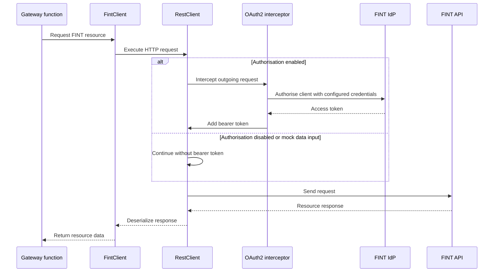

# FINT Kontroll FINT Gateway

## FINT Client Authorisation Flow

`FintClient` retrieves resources from FINT through the shared Spring `RestClient` bean. The client method itself does not fetch or attach access tokens; that is handled by the `RestClient` configuration before the HTTP request is sent.

When a function retrieves resources through `FintClient`, the flow is:

1. Spring injects the shared `RestClient` bean into `FintClient`.
2. If `fint.kontroll.datainput=fint` and `fint.resource-gateway.authorization=enabled`, `OAuthRestClientConfiguration` attaches an `OAuth2ClientHttpRequestInterceptor` to the `RestClient`.
3. For each outgoing FINT request, the interceptor resolves the configured client registration from `fint.client.registration-id`.
4. Spring Security authorises the client using the configured FINT username and password from `fint.client.username` and `fint.client.password`.
5. The interceptor adds the resulting bearer token to the outgoing request. Refresh tokens are reused by Spring Security when available.
6. `FintClient` executes the request and deserializes the response body, for example into `ObjectResources` for collection responses.

If authorisation is disabled, or `fint.kontroll.datainput=mock` is active, the `RestClient` is created without the OAuth2 interceptor. The same `FintClient` methods are then used, but requests are sent without a bearer token.

`ObjectResources` is only a generic wrapper for FINT collection responses where the concrete resource type is not known at compile time. It does not participate in authorisation.
